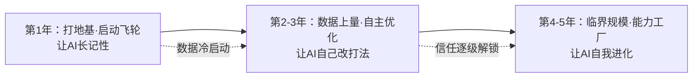
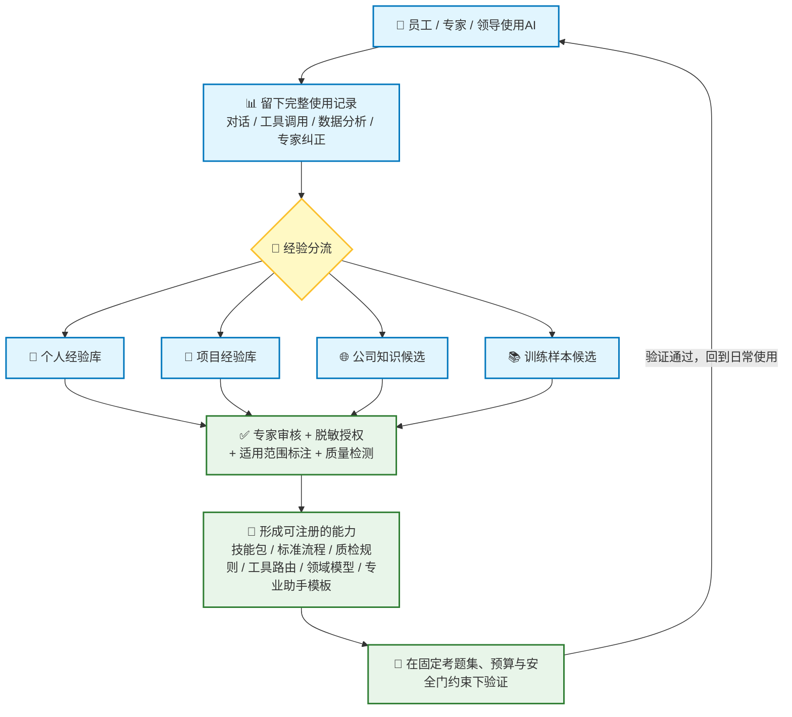

# 2026年模型组531——自我成长型AI（RSI Agent）五年迭代规划

# 一、我们要做什么：一句话说清楚

现在市面上的AI助手有个通病：**每次对话都从零开始**。同样的问题，换个时间问、换个人问，它都不记得，更谈不上进步。

我们要建设的RSI Agent（自我成长型AI），核心区别就一句话：

> **它会把每一次使用中获得的经验沉淀下来，让自己和"下一代自己"变得更强。**

打个比方：普通AI像"永远记不住事的临时工"，RSI Agent像"跟着老师傅学艺的徒弟"——记得住项目背景、学得会师傅的判断、攒得下失败的教训，最后还能把好做法整理成标准流程，传给整个团队。

它具体在四个层面"成长"：

| **成长层面** | **通俗说法** | **举例** |
| --- | --- | --- |
| 记性 | 记住项目背景、个人习惯、历史教训 | 不用每次重新解释"我们用的是这套材料体系" |
| 技能 | 把常用做法固化为可复用的技能包和标准流程 | 一次做好的充放电曲线分析，下次一键复用 |
| 打法 | 自己优化工具选择和工作步骤 | 发现"先查内部库、再做计算"的成功率更高，自动调整顺序 |
| 本身 | 用积累的高质量数据训练专属小模型 | 专属的电解液性质预测模型越用越准 |

（业内术语叫"递归自我改进"：AI不仅完成任务，还持续改进完成任务的那个"自己"。它的终极形态，是连"怎么改进自己"这件事本身也在被改进——就像忒修斯之船，船板一块块被换掉，最终成为一艘全新且更强的船。）

# 二、为什么值得做：五条价值

1.  **员工越用越顺手，专家的判断力被放大而不是被替代。** AI会从日常使用中记住项目上下文、个人偏好、常用流程和高频错误。结果是：员工少解释、少追问、少返工，用更短的对话完成更复杂的研发任务；专家从重复劳动中解放出来，把精力留给真正需要判断力的地方。

2.  **把"个人会"变成"组织会"，不怕人走、不怕墙多。** 电池设计经验往往分散在专家个人、项目组和历史文档里。这套系统会把对话、纠错、实验反馈和流程做法提炼成全公司可复用的经验库、技能包和标准流程，降低人员流动和部门壁垒带来的知识损耗。

3.  **知识可验证、可更新，避免把过时经验固化成流程。** 过去的经验可能过时、局部有效或只适用于特定材料体系。系统会对每条经验做来源追踪和适用范围标注，配合定期复检和专家审核，持续筛选、淘汰过时和错误的知识，避免公司反复踩同样的坑。

4.  **研发从"经验试错"走向"数据选优"。** 当使用记录、实验数据、仿真结果和专家反馈连通起来，公司就能"用数据选择更有价值的下一步实验"，直接服务于候选材料筛选、实验设计、配方优化、失效诊断和仿真编排，减少无效实验，提高研发吞吐。

5.  **决策更透明、可追溯、可复盘。** 系统会记录每条建议背后的数据、模型版本、工具和专家修正，让管理层清楚看到"为什么推荐这个方案、依据是什么、风险和适用边界在哪里"。电池研发是性能、安全、寿命、成本、工艺窗口的多目标权衡，这种透明度对决策质量尤其重要。

# 三、为什么需要3-5年：时间花在哪里

这是本规划最关键的一节。结论先行：

> **算法框架一年能搭好，但"学习材料"和"信任"只能用时间换。**

这套系统的最终能力 ≈ 算法 × 经验数据 × 组织信任。前者可控，后两者有客观规律，无法靠追加投入压缩：

| **要素** | **能否加速** | **原因** |
| --- | --- | --- |
| 算法框架 | 可以 | 1年内搭好，属于工程投入 |
| 经验数据 | 不能 | 只能靠日常使用一天天积累 |
| 组织信任 | 不能 | 只能靠一级级实绩解锁 |

## 原因一：AI变聪明的"教材"，只能在使用中慢慢攒（最核心）

它的学习材料不是从网上下载的，而是三样东西：员工与AI的每一次完整协作过程、专家的每一次纠正（最宝贵也最稀少的信号）、每次任务的成败结果。这些无法凭空制造，只能在使用中自然产生。因此数据积累有一条绕不开的"冷启动曲线"：

-   **第1年**：系统刚上线，像新员工入职第一天，懂的东西有限、用的人也少。这一年的任务是打好地基（数据管道、授权脱敏、审计回滚），把飞轮转起来；
-   **第2-3年**：使用量上来，积累了成千上万次真实任务记录和专家纠正，AI才开始"像老员工一样熟悉业务"，也才攒够材料支撑它"自己优化自己"；
-   **第4-5年**：数据、技能、信任达到临界规模，"越用越好用"的飞轮真正转起来，前期投入开始兑现复利。

尤其要说明：**电池研发的数据产生速度天然慢**。一次循环测试以天计，一个配方验证以月计——同样攒一万条高质量经验，聊天类产品可能三个月，我们可能需要三年。这不是执行不力，是行业属性决定的。

## 原因二："AI自己改进自己"是世界级前沿难题，从实验室到产线有硬门槛

全球该方向整体还处于实验室验证阶段（技术成熟度约3级/9级，9级为大规模商用，详见附录）。也就是说，**没有现成的工业级方案可以买，我们要做的是把实验室技术变成生产可用**。历史上新技术从论文到产线普遍需要3-5年（深度学习2012年提出、约2016年产业落地；大模型2020年问世、2022-2023年产品化），我们没有理由指望显著更快。

其中最难的不是"让AI改自己"，而是"**保证它不改坏**"。可以想象一个会给自己做手术的医生：每次改动前要先考试（回归评测）、有完整备份（可回滚）、先小范围试用（灰度发布）、再由专家把关（人工审核）。这套"安全门禁"机制本身的建设与验证就要以年为单位，而且必须在真实场景中长期运行，才能暴露所有边角问题。

还有一个只有时间能回答的问题：**单次改进容易，连续改进不退步极难**。AI连续多轮自我改进时，改动之间会互相干扰，可能在第七轮悄悄引入退化。这只能靠长时间的真实迭代记录来证明"连续3-5轮改进无回归"——这也是我们敢不敢逐步放大AI权限的唯一依据。

## 原因三：信任必须逐级解锁，能力逐级放大

就像没有企业会让入职第一周的新人独立负责关键实验，我们对AI的授权同样逐级推进：

| **阶段** | **AI的角色** | **解锁条件** |
| --- | --- | --- |
| 第1年 | 助手：查资料、写报告、解析数据，人来把关 | 治理体系建成、基础场景跑通 |
| 第2-3年 | 优化师：自主提出工具与流程的改进，先旁观验证再实际上岗 | 数据积累到位＋连续改进不退步的实证 |
| 第4-5年 | 方法论持有者：自主组装新的专业AI、改进自身 | 多年稳定运行记录＋安全零事故 |

每一级都要用上一级的实绩来换。跳级的风险是错误被"自我改进"机制放大——出一次重大事故，整个项目可能倒退一年以上。宁可慢，不能翻车。

## 原因四：专家经验长在人脑里，挖出来是慢功夫

电池设计的核心know-how分散在专家的判断里、项目组的复盘里、历史文档的角落里，大量是"只可意会"的隐性知识。把它们变成AI可用的显性规则，只能在一个个真实场景中"专家用、专家纠、AI学"，无法批量完成。这本质上是一场人机协作方式的组织变革——专家愿意用、习惯用、顺手纠正，本身就需要一两年的习惯养成。

同时知识会"过期"：材料体系在迭代，三年前的最优解可能是今天的陷阱。所以不仅要沉淀知识，还要建立持续筛选、淘汰、更新的"知识保鲜"机制——这套机制同样只能在时间里校准。

## 原因五：涉及配方、数据资产与知识产权，安全红线决定节奏

系统要接触实验数据、配方信息和专家经验。数据授权、脱敏、审计、回滚这些治理能力必须从第一天就建设，并在真实使用中反复检验，这部分工作会实实在在地占据第一年的相当篇幅。安全上的慢，是为了整体上的快。

## 三阶段路线图（一图看懂）

# 四、五年总目标（终点画像）

**建成一个面向电池材料研发的、受控的自我成长型AI体系：把员工和专家的使用轨迹、经验、历史实验、仿真结果和领域模型，持续转化为可复用、可验证、可回滚的研发能力，并让这些能力反过来提升材料筛选、实验设计、失效诊断和研发决策的质量。**

**终态能力画像（第五年应达到的状态）：**

| **终态能力** | **白话描述** |
| --- | --- |
| 个人与项目智能助手 | 系统稳定理解个人偏好、项目背景、材料体系和常用工作流。 |
| 公司级知识沉淀系统 | 专家纠错、报告修改、实验复盘持续沉淀为技能包、标准流程、设计规则和失败模式库。 |
| 研发能力货架 | 公司拥有可检索、可组合的专业AI助手、工具、质检规则、数据解析器和领域模型目录。 |
| 专业助手按需生产 | 按需求组合出电解液、正负极材料、硅碳负极、测试诊断、仿真编排等专业助手。 |
| 实验-仿真-反馈闭环 | 历史实验、仿真、专家反馈与主动学习连通，用于候选筛选、实验排序和失效诊断。 |
| 受控的自我改进 | 各子系统在授权范围内局部改进自己的经验库、技能、工具策略或模型。 |
| 全程可治理 | 所有模型、数据、流程、工具和发布版本可追溯、可审计、可灰度、可回滚；不发生未授权数据训练、越权工具调用或自动修改实验/生产参数。 |

# 五、第一年规划：让AI"长记性"——打好地基，启动飞轮

## 年度定位

打地基、启动数据飞轮：建立数据管道与治理框架，让AI开始积累和复用个人与集体经验，并在3-5个高频场景真正用起来。

## 为什么第一年只能做这些

-   **治理必须先行**：没有授权、脱敏、审计、回滚这套底座，数据不敢用、模型不敢训，一切后续无从谈起；
-   **数据冷启动**：系统刚上线，经验积累从零开始，"自己优化自己"还缺少学习材料；
-   **人和流程需要适应**：团队与用户都需要时间熟悉这套新的人机协作方式。

## 年度目标

| **目标** | **说明（白话）** |
| --- | --- |
| 对话更短 | AI记住项目背景、员工偏好、常用流程和领域约束，减少重复解释和追问。 |
| 一次做对 | 提升工具选择、参数填写、检索引用、数据解析和报告生成的一次成功率。 |
| 经验沉淀 | 从使用记录中提炼可复用的电池设计经验、标准流程、失败模式、工具模板和检查清单。 |
| 模型迭代起步 | 把高质量使用记录和专家纠正转成训练数据，支撑4-6次可回滚的定制模型迭代。 |
| 可治理 | 数据授权、脱敏、审计、发布、回滚的基础设施建成。 |

## 预计落地场景（选择强依赖个人＋集体知识的场景）

1.  电池文献/专利证据综述。

2.  测试数据解析与异常初筛。

3.  充放电曲线、EIS、dQ/dV分析报告。

4.  实验计划模板生成与检查清单。

5.  仿真任务编排和结果整理。

## 量化指标

| **指标** | **目标** | **说明** |
| --- | --- | --- |
| 平均对话轮次 | 下降20%-30% | 以同类任务复杂度分层对比。 |
| 工具调用一次成功率 | 提升15%-25% | 一次选中对的工具并正确填写参数。 |
| 检索引用正确率 | ≥90% | 由抽样人工审核或规则校验确认。 |
| 专家修正采纳率 | 形成稳定闭环 | 专家的每次纠正都能追踪到进了哪个经验库或训练集。 |
| 集体技能包有效率 | 复用命中率持续上升 | 不追求数量，追求被使用、被认可。 |
| 定制模型迭代次数 | 4-6次 | 少量高质量迭代，每次必须可回滚。 |

# 六、第三年规划：让AI"自己改打法"——从记住经验到自主优化

## 年度定位

从"AI会记住和提炼经验"升级为"AI能在可验证的场景中，自主提出并执行工作流、工具策略和专业助手组合的优化"，并用积累的数据训练出专属领域模型，形成"实验-仿真-反馈"闭环。

## 为什么必须等到第三年

-   **数据刚够用**：自主优化的学习材料是前两年积累的真实任务记录与专家纠正，第一年根本没有；
-   **安全机制要先用两年校准**：自动改进必须先在低风险场景长期验证可靠，再推广到关键场景；
-   **领域模型训练有前置条件**：需要先有清洗好的高质量数据集和验证过的价值场景，这本身就是前两年的产出。

## 年度目标

| **目标** | **说明（白话）** |
| --- | --- |
| 工作方式自主优化 | 在固定任务集上，AI自动提出工具选择、流程步骤的候选改进，先旁观验证（影子试运行）、再实际上岗。 |
| 专业助手自动组装 | 按任务需求从能力货架上组合出专业助手，如电解液分析助手、硅碳负极助手、电芯测试诊断助手。 |
| 领域模型自建自迭代 | 建设AI for Science基座模型：电解液性质预测、循环寿命预测、材料生成等。 |

## 预计落地场景

1.  自演化数据治理助手。

2.  领域模型的自设计＋自训练＋自迭代：

    1.  分子、电解液等材料的表征与性质预测。

    2.  材料生成基座模型。

    3.  电芯性能预测。

    4.  DFT、力场等计算仿真的加速与优化。

3.  电芯机理挖掘与发现。

## 量化指标

| **指标** | **目标** |
| --- | --- |
| 高频研发任务端到端成功率 | 再提升20%-30% |
| 工具调用失败后的自动恢复率 | ≥70% |
| 专业助手组装数量 | 3-5个进入生产试点 |
| 电芯机理挖掘与发现 | 10+个有效描述符 |
| 领域模型 | 2+个通过专家验收并投入实际研发闭环 |

# 七、第五年展望：形成"研发能力工厂"

*（第五年的具体形态将根据前三年实际进展滚动修订，此处仅给出方向性画像。）*

到第五年，随着数据、技能和信任达到临界规模，目标是形成"研发能力工厂"：

-   **按需生产**：面对新场景（新材料体系、新项目），能在数周内组装出可试运行的专业AI助手，而不是从零开发；
-   **自我进化**：各专业助手在授权、预算和安全门约束下，能够局部改进自己的工作方式和底层模型，并做到"连续多轮改进不退步"；
-   **公司级知识中枢**：集体经验库覆盖集团各业务，支撑新材料研发的整体决策。

## 关键指标（方向性）

| **指标** | **目标** |
| --- | --- |
| 组织知识复用覆盖率 | 关键研发流程95%以上可调用集体知识/质检规则。 |
| 新场景AI助手交付周期 | 从需求到影子试点缩短至数周级。 |
| 自我改进稳定性 | 固定领域内连续3-5轮迭代无显著回归。 |
| 领域模型价值 | 10+个模型在真实实验或高保真仿真闭环中证明价值。 |
| 主动学习效率 | AI建议的下一批实验，单位实验获得的新知识高于人工基线。 |
| 知识保鲜 | 过期、冲突、低质知识能被自动发现并由专家治理。 |

# 附录：技术成熟度说明（供技术背景读者）

社区在2026年已收敛出一个六级"优化阶梯"（Optimization Ladder，源自Lilian Weng 2026年博客《Harness Engineering for Self-Improvement》及其衍生的Awesome-Harness-Self-Improvement仓库），以"被进化的对象"为轴心区分自进化能力的成熟度：

| **阶梯** | **进化对象** | **代表工作** | **成熟度（TRL，1-9级）** |
| --- | --- | --- | --- |
| L0 | 指令Prompt | APE, OPRO, GEPA | 7-8（已大量工程化，GEPA甚至反超RL） |
| L1 | 上下文/记忆 | ACE, ReasoningBank, Dynamic Cheatsheet | 6-7（顶会在投/已收录，工程可用） |
| L2 | 工作流/拓扑 | ADAS, AFlow, GPTSwarm, AgentSquare | 5-6（搜索方法成熟，但收益边际递减） |
| L3 | Agent代码本身 | DGM、SICA、Self-Harness、RHO、MOSS | 3-4（有可复现开源实现，但均为单轮/窄域） |
| L4 | 元框架 | Meta-Harness、HSI、DSH | 2-3（刚出现，受底座模型能力硬约束） |
| L5 | 框架+模型权重联合 | SIA、SEAL、HELIX | 2-3（仅3-5个窄域任务验证，无法外推） |
| 开放式强RSI | 改进"改进方法"本身 | AI4AI-Bench显示的差距 | 1-2（无可信端到端证据） |

**综合判断：整体技术成熟度为TRL 3/9（实验室验证阶段），且各层级高度分化——从已产品化（7-9级）到纯理论（1-2级）横跨整个量表。**本规划第一年对应建设L3级生产能力，并在严格边界内启动窄域L4-L5式参数迭代尝试；第三年推进到L5（框架与模型权重联合进化）；第五年探索受限场景下的更高阶形态。
